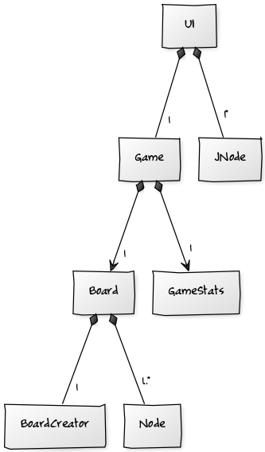

## :bomb: Minesweeper, labra17 :bomb:
### Intro

#### Subject

Minesweeper game with some graphical twists. 

#### Rules
 
 Basic rules same as in traditional minesweeper:

- The game is played on a grid of squares. 
- A predetermined amount of nodes contains a bomb
- The player must locate each bomb without clicking on them, using tips from non-bomb nodes. 
- if a player clicks on a node that is not a bomb, the game reveals all nodes not near bombs, connected to clicked node
- a revealed non-bomb node has the number of adjascent bombs, or is blank, if there are none. 

### Structure 

#### UI

The game has a graphical UI with which it can be played

#### Game

- Has amount of bombs
- Has an array of nodes
- Has stats
- Has it been won? 
- Maybe easy - medium - hard 
- Has GameStats for stats, and enum for difficulty 

#### Node

- Knows if it's a bomb
- Knows if it's flagged
- Knows if it has been revealed
- Knows amount of adjescent bombs 

#### Game stats 

- Time played
- Bombs left unflagged

#### UML 

#### Usage diagrams 

.png)

